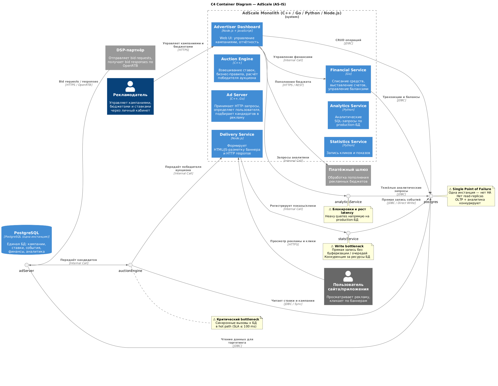

# AS-IS анализ (диагностика текущей архитектуры)

Архитектура исходной системы представлена на C4 Container диаграмме:



При её анализе можно выделить несколько проблем:

1. Главный тракт (Hot Path) - синхронный.  

   ```text
   Ad Server --> Auction Engine --> PostgreSQL
   ```

   При таким подходе, каждый HTTP-запрос клиентов проходит через прямой вызов к БД. Auction Engine, наиболее чувствительный к задержкам компонент, блокируется в ожидании I/O операций БД. Соответственно, увеличивается latency запросов, что делает невозможным стабильное соблюдение SLA (<100 мс).

2. Конкуренция за ресурсы БД (Noisy Neighbor).  

   ```text
   Пользователь сайта --> Delivery Service --> Statistics Service --> PostgreSQL

   Рекламодатель --> Advertiser Dashboard --> Analytics Service --> PostgreSQL
   ```

   Statistics Service (высокочастотная запись событий) и Analytics Service (тяжелые аналитические отчеты) используют ту же БД, что и главный контур (Financial Service, Auction Engine).  
   Statistics Service также напрямую ходит в БД при каждом событии и делает INSERT. Если БД не справляется, запросы копятся, соединения занимаются, оперативная память переполняется, и система начинает деградировать лавинообразно. Нагрузка событий (Event Stream) - самая большая по объему. Системе нехватает Backpressure.
   А тяжелые SQL-запросы из Analytics Service приводят к конфликтам по CPU, дисковому I/O и блокировкам таблиц, что напрямую увеличивает latency для ставок.

3. Единая точка отказа (Single Point of Failure, SPOF).  
   Сама БД PostgreSQL является единой точкой отказа. Через нее выполняются и транзакционные (OLTP) и аналитические (OLAP) запросы. Что приводит к конкуренции за ресурсы.  
   Кроме того, используется один инстанс БД, а значит нет HA (High Availability): если БД прекратит работу (любой сбой - диск, сеть, перегрузка), это приведет к полной остановке продаж и проигрышу рекламных аукционов.

4. Как видно из архитектурной схемы, деплой системы производится вручную, без контейнеризации.  
   Это приведет к увеличению времени реакции на ошибки (Mean Time to Detect, MTTD) и восстановления после сбоев (Mean Time to Repair, MTTR). Из-за этого также усложняется и сам процесс деплоя и настройки (системы-снежинки).

5. Отсутствует кэширование.  
   Отсутствует кэш для "горячих данных" (кампании, креативы, бюджеты). Это создает лишнюю нагрузку на сеть и CPU БД, вынуждая парсить одни и те же данные на каждый запрос, при условии что эти данные меняются редко.

6. Отсутствует асинхронная работа системы.  
   Нет ни Event Streaming, ни Message Queue. В связи с этим, даже процессы, которые непосредственно не требуются для ответа пользователю, значительно оказывают влияние на производительность системы и время ответа. Без этого система не сможет гасить пиковые нагрузки и это может приводить к каскадным сбоям.

## Узкие места и риски архитектуры

К узким местам в архитектуре можно отнести

| Компонент | Описание |
| -- | -- |
| PostgreSQL | один инстанс БД, единая БД для всех подмодулей монолита |
| Auction Engine | прямое обращения к БД при каждом запроса |
| Statistics Service | прямое обращение в БД для записи каждого события, без буферизации и батчей |
| Analytics Service | тяжёлые OLAP-запросы к БД, с которой система работает с OLTP характером нагрузки |
| Ad Server | latency (и как следствие SLA) напрямую зависят от загруженности БД |

В текущей ситуации исходя из схемы и описания есть следующие риски и архитектурные проблемы:

1. Отказ PostgreSQL приведет к недоступность всей системы.
2. Отсутствие кэширования, асинхронного взаимодействия и общая БД для всех компонентов системы приводит к невозможности масштабирования.
3. Высокая связанность (система-монолит) приводит к сложностям при развитии и деплое системы. Сейчас в монолите компоненты написаны на разных языках. Получается, например, что нельзя выкатить обновление сервиса статистики, не задев остальных. А также, например, утечка памяти в Python-аналитике может уронить C++-аукцион.
4. OLAP нагрузка в рамках одной БД приводит к значительной деградации OLTP операций.
5. Рост нагрузки на БД приводит к резкому увеличению задержек и нарушению SLA.
6. Взрывной рост нагрузки. Мы знаем цель: +20% (18k RPS) через 3 месяца и 50k через год. При текущей архитектуре попытка поднять нагрузку на 20% почти гарантированно приведет к деградации свыше 150 мс, так как система уже сейчас работает выше нормы (110-120 мс при норме 100).

## Риски для бизнеса

Исходя из описанных выше технических проблем архитектуры, можно сделать следующие выводы о рисках и влиянии на бизнес, если система продолжит существовать в текущем виде.

1. **Штрафы**.  
   Новый DSP-партнер выставляет штрафы за downtime и latency. Значит, плохая архитектура приведет к прямым финансовым потерям.
2. **Проигрыш аукционов**.
   Если наш RTB отвечает дольше 80-100 мс, DSP начнет отбрасывать наши ставки, а значит компания начнет терять выручку.
