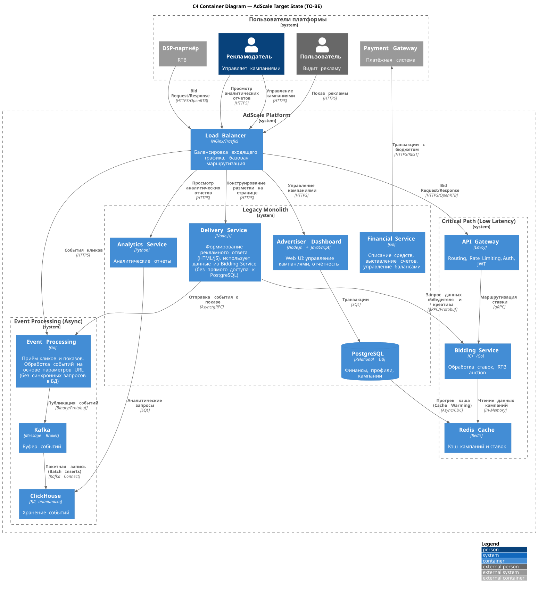

# TO-BE (целевая архитектура)

## Выбор архитектурного стиля (эволюционной стратегии)

Архитектурные драйверы по минимальным задержкам, срокам и бюджету (NFR-01, BC-01 и BC-02) исключают два крайних подхода:

1. **Сохранить монолит.**
   Неприемлемо. Монолит не может обеспечить требуемую Latency (P95 < 80–100 ms) из-за синхронных вызовов к единой БД и отсутствия изоляции ресурсов. Масштабирование монолита целиком не решает проблему конкуренции за ресурсы.

2. **Переписать всё на микросервисы.**
   Неприемлемо в текущих условиях. У компании нет SRE-практик, контейнеризации и опыта эксплуатации распределенных систем. Полное переписывание заняло бы более года и создало бы неприемлемые риски для непрерывности бизнеса.

Решение - используем эволюционный подход с применением паттерна **Strangler Fig**. Критически важные и наиболее нагруженные компоненты (сервис ставок и обработка событий) будут выделены из монолита первыми. Остальные компоненты продолжат работу в legacy-контуре до следующей итерации. Такой подход минимизирует риски и позволяет точечно масштабировать ресурсы под нагрузку 18k RPS.

С деталями технического анализа альтернатив и выбора решения можно ознакомиться в [ADR-001. Стратегия эволюции архитектуры (от монолита к микросервисам)](./adr/adr-001_microservices-evolution-strategy.md).

## Этапы доработки исходной архитектуры системы

Для достижения бизнес-целей потребуется доработка существующей архитектуры системы, чтобы она смогла удовлетворять более жестким требованиям SLA по доступности, производительности и задержке обработки Bid-запросов.

Суть стратегии развития системы эволюционным подходом заключается в том, что новые сервисы постепенно выделяются из монолита, а существующая функциональность продолжает работать до завершения миграции.

После анализа существующей архитектуры, был выявлен hot path, а также его ключевые узкие места (Auction Engine и PostgreSQL), и было принято решение начать декомпозицию монолита именно с него, выделить в **отдельный сервис Bidding Service** целый бизнес-домен.

С деталями технического анализа альтернатив и выбора решения можно ознакомиться в [ADR-002. Выделение Bidding Service в качестве первого приоритета](./adr/adr-002_BiddingService-as-primary-focus.md).

Следующим важным шагом в изменении архитектуры будет внедрение асинхронной обработки для бизнес-функциональности учета статистики по кликам и просмотрам, т.к. это второй по загруженности сервис (из-за очень большого потока событий, которые также синхронными запросами транзакционно нагружают PostgreSQL). Но ддя этого в архитектуру нужно ввести технологию для потоковой обработки событий.

Выбор был сделан в пользу решения на базе **Kafka**, так как нам в первую очередь нужна пропускная способность дисков и "буфер". Kafka идеально держит огромный поток. А также решение более надёжное в плане каскадных сбоев.

С деталями технического анализа альтернатив и выбора решения можно ознакомиться в [ADR-003. Выбор технологии для потоковой обработки событий](./adr/adr-003_event-processing-technology.md).

## Целевая архитектура (TO-BE)

Ниже представлена схема целевого решения

Ключевые моменты решения:

1. Изолированный сервис ставок. Из монолита удален **Auction Engine**, его роль теперь выполняет **Bidding Service**. Сервис входит в Hot Path и не имеет прямых синхронных вызовов к PostgreSQL.
2. Для того, чтобы **Bidding Service** обладал необходимой информацией и работал с низкой задержкой, он Bidding Service работает только с Redis (данные о рекламных кампаниях и ставках хранятся в памяти). Наполнение кэша выполняется заранее (Cache Warming) на основе данных из PostgreSQL.
3. Точка входа для DSP - **API Gateway** - отвечает за Rate Limiting, Auth, JWT. Позволяет сделать более стабильным взаимодействие.
4. Для аналитики используем **ClickHouse** (колоночная СУБД), оптимизированную для быстрых агрегаций по миллионам событий.
5. Вынесен **Event Processing** в отдельный процесс, получает большой поток событий о кликах и показах рекламы. Сделан асинхронным, работает через очереди Kafka. А также не имеет прямых синхронных вызовов к PostgreSQL, для него используется отдельная БД ClickHouse, таким образом произведено разделение OLTP и OLAP нагрузки.
6. **Event Processing** собирает события на основе параметров в URL, а не запросами в БД.
7. PostgreSQL остается как транзакционная БД для Financial Service и Advertiser Dashboard. Это позволяет гарантировать строгую консистентность (ACID) для денежных операций.
8. **Delivery Service** в монолите теперь отвечает только за выдачу размеченной страницы клиенту. В момент запроса размеченной страницы Delivery Service связывается с Bidding Service, чтобы узнать победителя (для кого и в рамках какой кампании выдавать рекламу), и формирует событие начала показа рекламы.
9. **Analytics Service** пока остается в рамках монолита, но за выполнением OLAP-запросов обращается в специальную БД, а не ходит к PostgreSQL.
10. Добавлен **Load Balancer**, кроме основного функционала, он позволяет обеспечивать реализацию паттерна **Strangler Fig**, чтобы перенаправлять "удушенный" в монолите функционал на выделенные сервисы.
