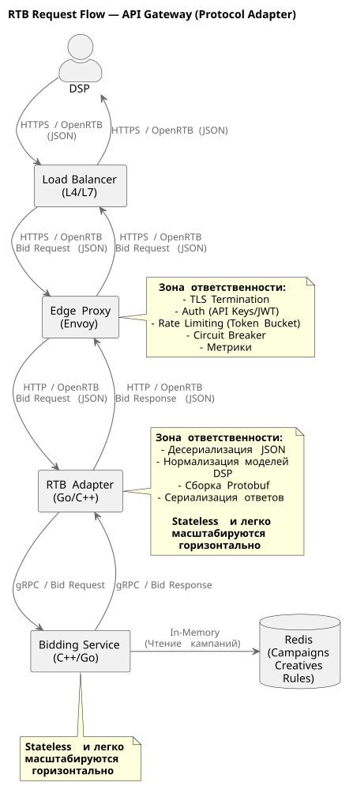
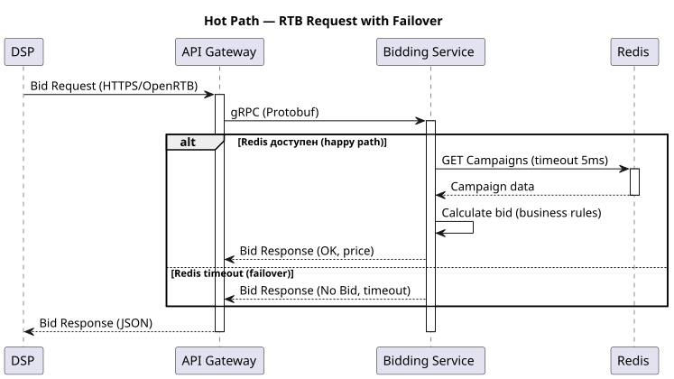

# Спецификация API Gateway для интеграции с DSP

Это единая точка входа запросов от внешних DSP-площадок и обеспечивает безопасную, масштабируемую и отказоустойчивую обработку запросов на участие в RTB-аукционах.

## Границы сервиса

* приём запросов от DSP по протоколу HTTP/OpenRTB
* десериализовать JSON
* конвертировать JSON во внутренний Protobuf
* отправить запрос в Bidding Service по gRPC
* получить ответ от Bidding Service
* сериализовать обратно в OpenRTB JSON
* отдать ответ DSP
* терминирует TLS
* аутентификация клиентов
* ограничение частоты запросов (Rate Limiting)
* применение паттерна Circuit Breaker
* мониторинг производительности и логирование.

## Обоснование

Однако в нашей архитектуре это будет не чистый API Gateway в виде одного сервиса.

Слой **API Gateway** разделен на два компонента:

1. **Edge Proxy (Nginx/Traefik/Envoy)**  
   Отвечает за сетевое взаимодействие, TLS, Rate Limiting, Circuit Breaking. Работает на L4/L7 уровне.
2. **RTB Adapter (Edge Service)**  
   Отвечает за адаптацию протокола. Отвечает за то, чтобы "спрятать" особенности конкретных DSP-партнеров. Преобразует внешний OpenRTB (JSON) во внутренний фиксированный Protobuf.

Несмотря на то, что OpenRTB это открытый технический стандарт, на практике многие DSP-партнеры добавляют в него свои кастомные решения/поля, т.к. стандарт допускает расширения.

Чтобы максимально защитить Bidding Service и оставить его бизнес-логику чистой, мы будем применять паттерн **Protocol Adapter**. Таким образом у этого сервиса будет независимый жизненный цикл (в том числе и упрощение тестирования), и вопросы сериализации/десериализации OpenRTB (JSON) можно будет масштабировать отдельно.

Таким образом, общая схема прохождения запроса выглядит так

## Выбор API Gateway

Как утверждалось выше, API Gateway разделен на 2 слоя.

В качестве **Edge API Gateway** выбран **Envoy Proxy**, т.к. он позволяет получить:

* встроенная поддержка HTTP/2 и gRPC (для расширения интеграций)
* эффективная балансировка нагрузки
* поддержка механизма Rate Limiting
* поддержка механизма Circuit Breaker
* поддержка механизма Retry
* интеграция с Prometheus и Grafana
* динамическая конфигурируемость без перезапуска.

В качестве **RTB Adapter** будет своя реализация на C++/Go промежуточного сервиса, заточенного только под RTB, для 80 000 RPS и ультранизкой задержки. Его задача - трансформация протоколов OpenRTB в gRPC и обратно, оставляя Bidding Service только бизнес-логику по работе со ставками.

## Эндпоинты и маршрутизация

Все внешние запросы поступают через единый REST API.

| Метод | Эндпоинт | Описание |
| -- | -- | -- |
| GET | `/health/live` | Проверка доступности сервиса, жив ли |
| GET | `/health/ready` | Проверка готовности обслуживать запросы, включая внешние зависимости |
| GET | `/metrics` | Метрики Prometheus |
| POST | `/v1/rtb/bid` | Запрос аукциона |

## Безопасность

* **TLS**  
  Все входящие соединения только HTTPS. Терминирование TLS траффика происходит на **Edge API Gateway**.
* **Auth**  
  Проверка API-ключей DSP (заголовок, наподобие `x-dsp-key`) или OAuth 2.0 Bearer Token. Проверка сроков действия токенов, журналирование результатов.
* Поддержка **JWT** для будущих интеграций

При неуспешной проверке возвращается ответ: `401 Unauthorized`

## Отказоустойчивость

Обеспечивается разными факторами, в частности - реализацией паттернов **Rate Limiting** и **Circuit Breaker** на стороне API Gateway.

## Функция Rate Limiting

Позволяет организовать ограничение на уровне DSP-партнера: например, не более N RPS на ключ. Т.о. отбрасываем лишний трафик на входе системы, предотвращая деградацию производительности платформы.

Алгоритм: Token Bucket. При этом для каждой DSP-площадки можно настраивать индивидуальные лимиты.

Если лимит превышен: возвращаем `429 Too Many Requests`

## Функция Circuit Breaker

По умолчанию, API Gateway работает в состоянии "замкнутой цепи" (Closed State). Запросы проходят на backend.

Если backend сервис начинает тормозить (P95 > 80 мс) или отдавать ошибки (Error Rate > 1%), API Gateway размыкает цепь (Open State).  
В разомкнутом состоянии API Gateway мгновенно возвращает **No Bid**, не нагружая backend сервис. Кроме того, если отсылать `503 Service Unavailable`, то DSP-платформа может исключить нас из аукциона. Поэтому используется Fallback-заглушка.

Периодически (Half-Open State) API Gateway пытается отправить пробный запрос в backend сервис.

Если backend сервис возвращается в нормальное состояние работы - цепь снова замыкается (Closed State).

## Observability

Шлюз может собирать следующие **метрики** для мониторинга:

* **RPS** - количество запросов
* **Latency (P95/P99)** - задержка времени ответа
* **Error Rate** - процент ошибок
* **Rate Limit Rejections** - количество отклоненных запросов функцией Rate Limiting
* **Circuit Breaker State** - состояние автоматического размыкателя
* **Active Connections** - количество активных соединений
* **HTTP 4xx** - рейт по ошибкам клиента
* **HTTP 5xx** - рейт по ошибкам сервера.

Метрики экспортируются в Prometheus и используются Grafana для построения дашбордов и настройки алертинга.

**Трейсинг**: Передача `x-request-id` от LB до Bidding.

**Логи**: Только агрегированные данные (сырые логи при 80k RPS будет слишком дорого). Используются для диагностики, аудита и анализа производительности.

Для удобства изучения логов, нужно логировать:

* Request ID
* DSP ID
* время получения запроса
* время обработки
* HTTP-статус
* код ошибки (при наличии)
* IP-адрес клиента.

## Нефункциональные требования

* **Throughput**: 18 000 RPS
* **Latency Overhead**: < 5 мс (на трансформацию)
* **Latency**: P95 < 100 мс
* **Availability**: 99.9%
