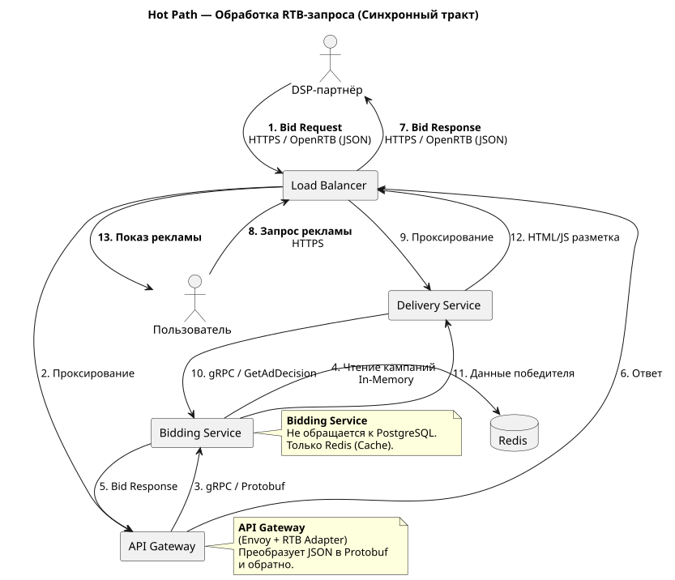
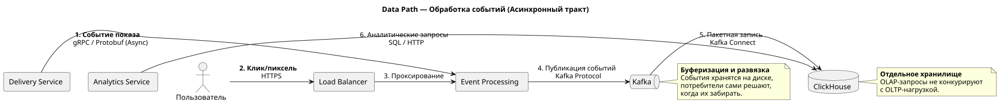

# Проектирование взаимодействия сервисов

## Общая схема взаимодействия

### Поток Hot Path

Что показывает диаграмма:

* основной путь ставки (шаги 1–7)
* Delivery Service получает решение по рекламе (шаги 8–13)
* Bidding Service изолирован и работает только с Redis.

### Поток Data Path

Что показывает диаграмма:

* события идут в обход PostgreSQL
* Kafka буферизует поток
* ClickHouse используется только для аналитики.

**Важно**: Списание бюджетов происходит асинхронно. Bidding Service не изменяет бюджеты. События о показах попадают в Kafka, откуда их забирает Financial Service (через отдельный consumer), обновляет балансы и при необходимости через CDC обновляет статус кампании в Redis.

## Сводная таблица взаимодействий

| Инициатор | Получатель | Тип взаимодействия | Протокол | Данные |
| -- | -- | -- | -- | -- |
| DSP | API Gateway | Синхронный (Req-Resp) | HTTPS/OpenRTB (JSON) | Bid Request |
| API Gateway | Bidding Service | Синхронный (Req-Resp) | gRPC/Protobuf | Валидированный Bid Request |
| Bidding Service | Redis | Синхронный (Read-Through) | Redis (RESP) | Данные кампаний |
| Delivery Service | Bidding Service | Синхронный (Req-Resp) | gRPC/Protobuf | Ad Decision |
| Delivery Service | Event Processing | Асинхронный (Publish) | gRPC/Protobuf (Async) | События показов |
| Event Processing | Kafka | Асинхронный (Publish) | Kafka Protocol | События (клики/показы) |
| Kafka | ClickHouse | Асинхронный (Consumer) | Kafka Connect / Native | Пакетная запись |
| PostgreSQL | Redis | Асинхронный (CDC) | WAL/CDC (Debezium) | Обновление кэша |
| Analytics Service | ClickHouse | Синхронный (Req-Resp) | SQL/HTTP | Аналитические выборки |

На самом деле под API Gateway в архитектуре подразумевается композитное решение, состоящее из двух слоёв. Для упрощения, в талице выше указан только тип взаимодействия с API Gateway на входе и на выходе, чтобы не повторяться. С деталями внутренней реализации можно ознакомиться в соответствующем [документе](./api-gateway.md). Использование API Gateway позволяет скрыть внутреннюю структуру микросервисов и обеспечить единую точку входа для всех DSP, с возможностью дальнейшего расширения списка интеграций с платформами.

## Обоснование выбора протоколов

* **gRPC для внутренних сервисов**  
  Поскольку расчёт ставки выполняется < 100 мс, уменьшение задержек внутренних вызовов критично для соблюдения SLA. gRPC обеспечивает:
  * строгие контракты
  * бинарная сериализация уменьшает объём передаваемых данных
  * HTTP/2 поддерживает мультиплексирование запросов
  * меньше потребление CPU и сетевых ресурсов.
* **REST HTTPS/OpenRTB для DSP**  
  Стандарт индустрии. Большинство DSP взаимодействуют по HTTP(S) с использованием JSON. Поэтому внешнее API строится на REST.
  * совместимость с большинством DSP
  * простота интеграции
  * использование стандартных HTTP-механизмов (TLS, заголовки, коды ответов)
  * отсутствие необходимости поддерживать специализированные клиенты.
* **Kafka для событий**  
  Системе в первую очередь нужно:
  * пропускная способность дисков, "буфер", долговременное хранение
  * держать огромный поток событий и пиковые всплески
  * иметь возможность подключать нескольких потребителей
  * хорошо поддаваться горизонтальному масштабированию
  * быть устойчивой в плане каскадных сбоев.
  С деталями технического анализа альтернатив и выбора решения можно ознакомиться в [ADR-003. Выбор технологии для потоковой обработки событий](../Task1/adr/adr-003_event-processing-technology.md).
* **Redis (RESP)**  
  Системе в первую очередь требуется увеличить скорость ответа на запросы от DSP-платформ и обеспечить высокую производительность. Поэтому требуется отказаться от синхронного взаимодействия с БД PostgreSQL и перенести данные в in-memory. Обращение к данным к кэше требует накладных расходов < 1мс. Кроме того, для работы Bidding Service нужно лишь читать данные (о кампаниях, бюджетах, контенте и т.д.), поэтому оправданно иметь доступ только к материализованному представлению состояний.
* Внутренняя структура API Gateway (Envoy + RTB Adapter) детально описана в [api-gateway.md](./api-gateway.md).

## Паттерны взаимодействия

* **Request-Response (Синхронный)**  
  Используется для расчета ставок (RTB аукцион), запросах разметок с рекламным контентом (запросы к Delivery Service), проверка бюджетов и таргетинга, запрос данных о победителях аукционов.  
  Ключевой фактор — низкая латентность и потребность в немедленном ответе.

* **Publish-Subscribe (Асинхронный)**  
  Используется для потока событий (кликов/показов).  
  Ключевой фактор — развязка, устойчивость к пикам, сохранность данных.

* **Event-Driven / CDC**  
  Используется для прогрева кэша из PostgreSQL на старте, а также для доставки обновлений из WAL базы данных, чтобы в Redis хранилась материализация с возможностью только для чтения.  
  Ключевой фактор — реакция на изменения состояния.

## Итог

Такое разделение соответствует требованиям проекта: критический путь (Hot Path) обработки ставок остаётся максимально быстрым благодаря gRPC, интеграция с внешними DSP обеспечивается через совместимый REST/HTTPS, а высокочастотные события кликов и показов (Data Path) обрабатываются асинхронно через Kafka, не увеличивая время ответа на запрос ставки.
